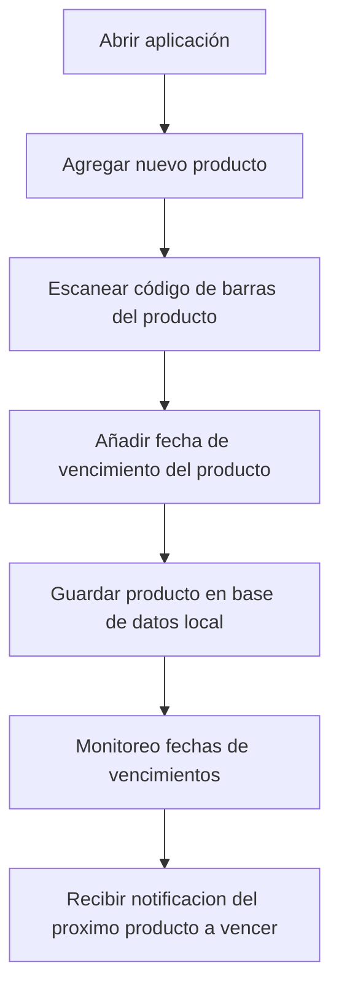

# FreshFood

#### Descripción
Aplicación diseñada para ayudar a las personas a organizar sus alimentos en la despensa y el refrigerador, promoviendo un consumo responsable y reduciendo el desperdicio.
#### Objetivo principal  
Facilitar que el usuario mantenga un orden en los productos almacenados en su hogar y reciba notificaciones cuando un alimento esté próximo a vencer, con varios días de anticipación.

#### Caracteristicas propias del móvil
* Uso de cámara para escaneo.
* Notificaciones push locales

#### Historias de usuario:

* US-001: Como usuario quiero agregar producto escaneando el codigo de barras para facilitarme el tiempo de escribir
* US-002: Como usuario necesito poder escribir fecha manualmente para frutas/verduras
* US-003: Como usuario quiero ver la lista de productos para no mezclar productos de diferente tipo
* US-004: Como usuario espero recibir notificaciones de vencimiento dias antes para no desperdiciar comida
* US-005: Como usuario quiero editar información erronea de un producto para no cunfundirme 
* US-006: Como usuario me gustaria eliminar/marcar como consumido para no seguir recibiendo notificaciones de ese producto
* US-007: Como usuario me gustaria poder personalizar hora de notificaciones para que no se vuelva estresante

#### Requerimientos RNF
* Compatibilidad con versiones superiores
* Agregar productos en poco tiempo
* Escalabilidad, muchos usuarios

#### Requerimientos RF
* Agregar productos con escaneo 
* Visualizar productos en una lista 
* Editar productos o modificar cualquier campo
* Entregar notificaciones con alertas
* OCR para detectar fechas en etiquetas
* Encriptación de datos

#### Instrucciones de uso
* inicio y carga:
  - Al abrir la aplicacion verás un icono y un indicador de carga, luego de 3 segundos entrarás al menu automaticamente.
* Menú principal:
  - Revisa la sección "Próximos a vencer" para ver qué alimentos debes consumir pronto.   
  - Botón refrigerador para gestionar los productos fríos.
  - Botón despensa para gestionar alimentos no perecibles o que no requieran refrigeración.
* Gestión del refrigerador o despensa:
  - Podrás visualizar la lista completa de productos guardados con sus respectivas fechas de vencimiento.
  - Presiona el botón flotante (+) en la esquina inferior derecha para poder ingresar el nombre y la fecha de vencimiento de tu nuevo producto.
  - Presiona un producto para abrir una ventana emergente con informacion detallada.
  - Presiona el icono de lapiz para poder editar tu producto y luego en "guardar" para confirmar la acción.
  - Presiona el icono de papelera para poder eliminar el producto seleccionado y luego en "eliminar" para confirmar la acción.
  - Vuelve al menú utilizando la flecha superior izquierda. 

Diagrama de flujo: [Diagrama](https://mermaid.ai/d/7832c19f-835c-4de8-adb6-ffc117a63b99)

[RESEARCH.md](./RESEARCH.md)

